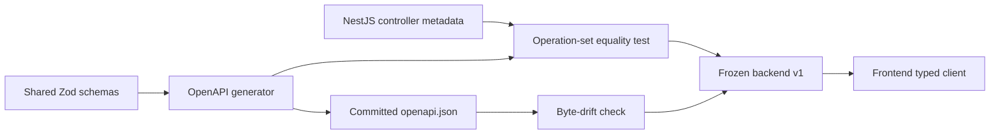

# Backend Contract Freeze

## Frozen Surface

The backend v1 surface contains 126 paths and 142 HTTP operations. Runtime NestJS controller
metadata, shared Zod schemas, generated OpenAPI 3.1, and the committed OpenAPI artifact are one
enforced contract chain.

The operation equality test walks `AppModule` imports, reads controller and handler path/method
metadata, normalizes `:parameter` into OpenAPI `{parameter}`, and compares exact method/path sets.
Duplicate or unmatched operations fail unit tests.

The reconciliation closed these existing gaps:

- supplier job detail read, activation, deactivation, and job reorder;
- TMMIN job list and checklist-version list;
- line/job assignment route parameter names.

## Versioning Rules

Frozen:

- OpenAPI `3.1.0`;
- API `1.0.0`;
- public route method/path/parameter identity;
- request requiredness and validation semantics;
- enum, lifecycle status, response result, and problem-code names;
- External event schema `1.0`.

Allowed within v1:

- optional response fields;
- pagination metadata;
- backward-compatible filter and sort inputs;
- new safe error codes for previously unspecified failure cases;
- new read-only endpoints;
- additive indexes and internal query changes.

Requires migration plan or a new version:

- route or field removal/rename;
- a new required request field;
- changed meaning or authorization scope;
- enum/status removal or rename;
- a different idempotency or transition rule;
- incompatible External event payload.

## Test Layers

| Layer | Evidence |
|---|---|
| Shared contract | Zod valid/invalid examples, strict over-posting rejection |
| Operation inventory | 142 runtime operations equal 142 OpenAPI operations |
| Artifact | generated JSON equals committed JSON |
| Unit policy | state machines, canonicalization, IP policy, rate windows/buckets |
| PostgreSQL integration | auth, tenancy, master, shift, approval, movement, read models, outbox, External |
| Concurrency | admin replacement, outbox claim, shift/Henkaten/reservation/approval and identical ingest races |
| Security negative | cross-realm/tenant/role, CSRF/CORS, object scope, upload, PII, allowlist, epoch, revoke |
| Capacity | explicit Compact HTTP baseline and query plans |

## Security Freeze

No known Critical or High backend finding remains in the tested scope. The freeze preserves these
boundaries:

- supplier scope comes from the authenticated principal, never a supplier request body;
- TMMIN cross-tenant reads and mutations require explicit capabilities;
- CSRF is required for session-authenticated mutations; CORS is origin allowlisted;
- external authorization is client/supplier/epoch/scope/IP bound;
- secret and token plaintext are never persisted or logged;
- strict schemas reject over-posting and the External contract excludes Hosted PII;
- raw audit, ingestion, decision, transition, and movement evidence remains immutable.

Security behavior still depends on the single-instance deployment assumption for in-memory abuse
counters. A second API replica is not allowed until rate counters are coordinated.

## Post-freeze Change Review

Every backend change used by frontend work must answer:

1. Is the route inventory still equal?
2. Is the change additive within the rules above?
3. Do runtime Zod and OpenAPI describe the same input/output?
4. Does authorization preserve realm, tenant, role, and object scope?
5. Does persistence need an expand/contract migration or only an additive index?
6. Which unit, integration, security, or baseline evidence changed?
