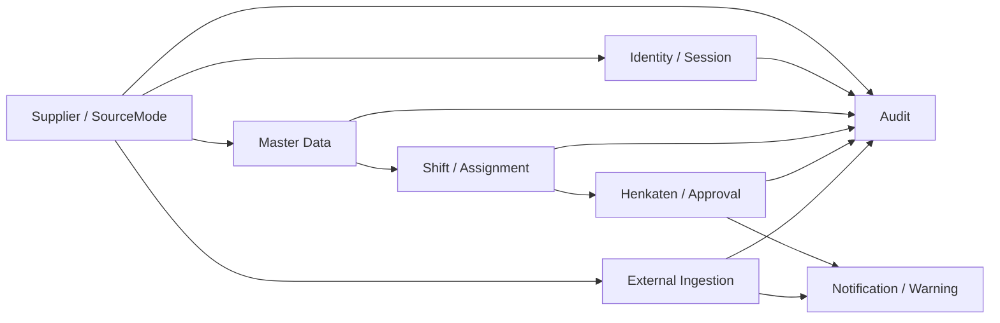

# Domain Model and Transaction Ownership

Status: Normative implementation baseline

Date: 2026-07-23

Source: `.agent/PRD.md`

## 1. Purpose

This document defines aggregate ownership and mutation boundaries. It does not replace the PRD.
Entity fields remain governed by the PRD and future Prisma migrations.

## 2. Global Rules

- Every tenant-owned aggregate has one unambiguous `supplierId`.
- Supplier-facing commands derive supplier scope from the authenticated principal.
- Mutable aggregate roots own a positive integer `version`.
- A command may read another aggregate but may mutate it only through the owning application service
  or an explicitly documented cross-aggregate transaction.
- Historical snapshots do not follow later master-data edits.
- Terminal and ledger entities are append-only or immutable.
- Audit and outbox writes required by a mutation share its transaction.

## 3. Aggregate Map

The arrows denote reference or event flow, not permission to write another aggregate directly.

## 4. Supplier and Source Mode

| Attribute | Definition |
|---|---|
| Aggregate root | `Supplier` |
| Owned state | supplier code/name, active state, source mode, source epoch, default timezone/settings |
| Invariants | supplier code globally unique; one active source mode; epoch monotonically increases |
| Mutation owner | `SupplierApplicationService` |
| Tenant boundary | global TMMIN-managed root; all descendant tenant data references its ID |
| Version owner | `Supplier.version` |
| Emits | source-mode changed, supplier activated/deactivated |
| References | readiness results and required Hosted configuration by ID/read model |

Source-mode cutover is a Supplier transaction. It verifies no active shift or Open Henkaten, revokes
the old source's sessions/credentials, increments `sourceEpoch`, records audit, and activates the new
source only after preflight. Historic records keep their original mode and epoch.

## 5. Identity and Session

| Attribute | Definition |
|---|---|
| Aggregate roots | `User`, `Session`, `ExternalApiClient` |
| Owned state | identity realm, username, role, password metadata, account state, sessions, client secrets |
| Invariants | username unique per realm/tenant; one active Supplier Admin; MP has no User; secret plaintext never persists |
| Mutation owner | `IdentityApplicationService` |
| Tenant boundary | TMMIN realm or exactly one supplier |
| Version owner | `User.version`, `ExternalApiClient.version`; Session lifecycle is atomic by ID |
| Emits | account changed, session revoked, client credential rotated/revoked |
| References | Member ID for supplier operational users; Supplier source epoch |

Role changes, password reset/change, deactivation, and source cutover revoke affected sessions.
Approval and audit history retain actor snapshots when a user or member changes later.

## 6. Master Data

| Attribute | Definition |
|---|---|
| Aggregate roots | `Member`, `Line`, `Job`, `Part`, `ShiftTemplate`, `ChecklistTemplate` |
| Owned state | member/account linkage, photo metadata, line/jobs, part identity, shift definition, checklist versions/items |
| Invariants | tenant uniqueness; immutable member role; permanent logical retention; immutable published checklist versions |
| Mutation owner | capability-specific Master Data services |
| Tenant boundary | exactly one supplier |
| Version owner | each mutable master root |
| Emits | master-data created/changed/deactivated, checklist published |
| References | User ID, photo object ID, default assignments |

`Job` belongs to one immutable `Line`. A checklist template owns one mutable persisted draft;
publishing appends an immutable ordered version. All master data is corrected, deactivated, and
reactivated without a public hard-delete path.

## 7. Shift and Assignment

| Attribute | Definition |
|---|---|
| Aggregate root | `ShiftRun` |
| Owned state | status, line/template/business-date snapshot, working assignments, start/end/override summary |
| Supporting roots | typed `DefaultAssignmentSet` relations, `AssignmentIssue` |
| Ledger | `AssignmentMovement` |
| Invariants | one active shift per line; one MP per working job; one job per working MP; hard gates before normal start |
| Mutation owner | `ShiftApplicationService` |
| Tenant boundary | exactly one supplier |
| Version owner | `ShiftRun.version`; mutable default and issue roots have their own version |
| Emits | shift started/overridden/ended, working assignment changed, issue opened/resolved |
| References | line/job/member/checklist IDs plus immutable start snapshots |

### 7.1 Start Shift transaction

1. Lock the line and candidate ShiftRun.
2. Assert no active ShiftRun for the line.
3. read and validate default assignments and active checklist versions;
4. evaluate vacancy, conflict, reservation, Assignment Issue, and carry-over Open Henkaten gates;
5. create the working-assignment snapshot;
6. mark the ShiftRun Active;
7. append audit and outbox.

Emergency start uses the same transaction but requires Supplier Admin, a reason, and persisted failed
checks.

### 7.2 End Shift transaction

1. Lock ShiftRun.
2. Lock associated Open Henkaten in deterministic order.
3. cancel each Open Henkaten with `SHIFT_ENDED`;
4. release reservations and invalidate pending routes;
5. close warnings;
6. close shift-bound unresolved issues;
7. remove active working assignments;
8. mark the ShiftRun Ended and persist summary;
9. append audit and outbox.

Default assignments are never mutated by End Shift.

## 8. Henkaten and Approval

| Attribute | Definition |
|---|---|
| Aggregate root | `Henkaten` |
| Owned state | lifecycle, source snapshots, category detail, checklist snapshots/answers, approval routes, clone relation |
| Supporting root | `MPReservation` for Man |
| Invariants | valid transition only; all checklist answers Yes; terminal immutable; one decision per route |
| Mutation owner | `HenkatenApplicationService` |
| Tenant boundary | exactly one supplier |
| Version owner | `Henkaten.version` |
| Emits | opened, approval recorded, approved/rejected/cancelled, reservation created/released, MP moved |
| References | ShiftRun/planned shift, assignments, part/job/member snapshot |

### 8.1 Submission

Submission validates line/job/part/checklist and creates the Henkaten, two pending approval routes,
warning, audit, and outbox atomically. Man submission also reserves the replacement MP without
changing working assignment.

### 8.2 Final approval and Man movement

Final approval is one Henkaten-owned transaction. When both routes approve a Man Henkaten, it locks
the Henkaten, reservation, target/source jobs, and involved MPs in canonical order; applies the
movement; releases the reservation; creates the immutable movement ledger and donor Assignment
Issue; closes the warning; and appends audit/outbox.

The first reject immediately finalizes Rejected and marks the other pending route Not Required.

## 9. Notification and Warning

| Attribute | Definition |
|---|---|
| Aggregate roots | `WarningInstance`, `Notification` |
| Owned state | warning lifecycle, recipient/read state, deep-link metadata |
| Invariants | one warning per Henkaten; read state never changes business state; idempotent generation |
| Mutation owner | domain transaction for warning; notification consumer for Notification |
| Tenant boundary | supplier plus permitted TMMIN scope |
| Version owner | warning transition or notification read version |
| Emits | warning opened/closed, notification created/read |
| References | source event and authorized resource IDs |

Warnings are transactionally created/closed with Henkaten or external projection state. Notification
records are produced idempotently from outbox events.

## 10. External Ingestion

| Attribute | Definition |
|---|---|
| Aggregate roots | `ExternalIngestionEvent`, `ExternalHenkatenProjection` |
| Owned state | raw canonical payload/hash/result; current monotonic source projection |
| Invariants | source epoch match; event ID idempotency; source versions contiguous; terminal immutable |
| Mutation owner | `ExternalIngestionApplicationService` |
| Tenant boundary | credential-bound supplier and source epoch |
| Version owner | projection `sourceVersion`; ingestion event immutable |
| Emits | ingestion accepted/rejected, projection updated, warning opened/closed |
| References | ExternalApiClient and supplier-attested snapshots |

Raw event insert, payload-hash comparison, source-version validation, projection update, warning
change, audit, and outbox are one transaction per event. Batch processing calls that transaction per
item.

## 11. Audit

| Attribute | Definition |
|---|---|
| Aggregate root | `AuditEvent` (append-only record) |
| Owned state | actor/client scope, action, resource, sanitized change summary, result, correlation |
| Invariants | immutable; no secret or credential; tenant scope explicit |
| Mutation owner | owning application transaction or security-event recorder |
| Tenant boundary | supplier or TMMIN realm |
| Version owner | none; records are immutable |
| Emits | none |
| References | opaque actor/resource IDs and snapshots |

Audit access is itself audited. Audit does not store password hashes, session/client secrets, raw
authorization values, cookies, or unsanitized photo/freeform payloads.

## 12. Cross-aggregate Mutation Matrix

| Workflow | Transaction owner | Aggregates locked/changed |
|---|---|---|
| Source-mode cutover | Supplier | Supplier, sessions/clients, audit, outbox |
| Start Shift | Shift | Line, ShiftRun, assignment snapshot, audit, outbox |
| Emergency Start | Shift | same as Start plus failed-gate snapshot/notifications |
| Henkaten submission | Henkaten | Henkaten, routes, optional reservation, warning, audit, outbox |
| Approval decision | Henkaten | Henkaten/routes, optional assignment movement/issue, warning, audit, outbox |
| Withdraw | Henkaten | Henkaten, reservation, warning, routes, audit, outbox |
| End Shift | Shift | ShiftRun, Open Henkaten/routes/reservations/warnings, assignments/issues, audit/outbox |
| External event | External Ingestion | raw event, projection, warning, audit, outbox |
