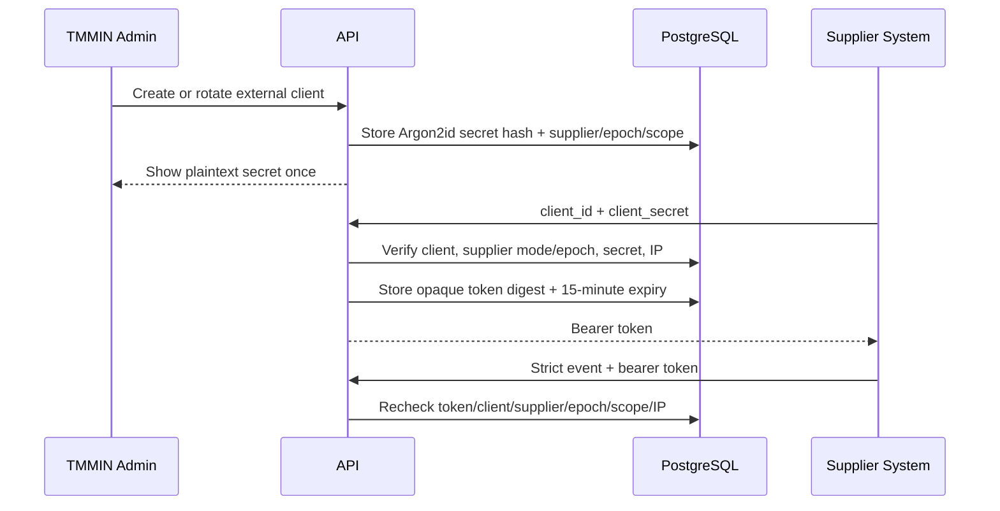
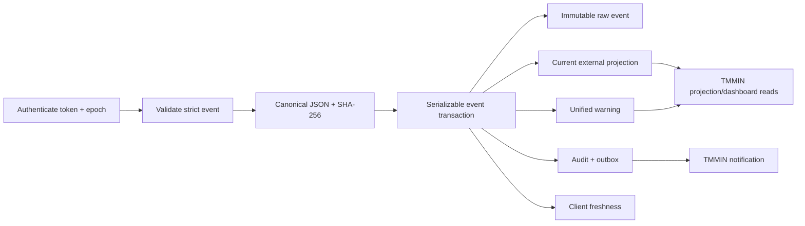

# External Ingestion Architecture

## Boundary

External integration is monitoring-only. It accepts supplier-attested line, shift, job, part,
change, checklist, and approval snapshots. It does not accept Hosted member identity, registration
number, photo, account, attendance, health, skill, email, phone, password, or credential data.
External clients cannot call supplier Hosted workflow routes.

## Credential and Authorization Flow

The authorization tuple is `(client, supplier, sourceEpoch, scope, source IP)`. Client revocation
revokes all secrets and outstanding tokens. Cutover to Hosted revokes active external clients, and
every request also fails closed when the supplier mode or epoch differs.

## Event Contract

The `1.0` envelope contains:

- opaque `eventId`, `sourceHenkatenId`, and contiguous positive `sourceVersion`;
- one lifecycle event type and matching current status;
- supplier-attested line, shift, job, and part snapshots;
- one discriminated MAN, MACHINE, MATERIAL, or METHOD change payload;
- a versioned checklist whose answers are all `YES`;
- approval decisions required by terminal status;
- bounded safe metadata.

Zod objects are strict. Unknown fields, including common PII and credential-shaped fields, fail
validation. The HTTP JSON parser caps request bodies at 5 MiB, and a batch contains at most 500
items.

## Transaction and Idempotency

An identical `(supplier, epoch, eventId)` retry returns `DUPLICATE`. A different canonical hash for
that key returns `409 IDEMPOTENCY_CONFLICT`. A projection starts with `HENKATEN_OPENED` version 1,
then accepts only `current + 1`; Approved, Rejected, and Cancelled are terminal.

PostgreSQL uniqueness protects event IDs and source versions. A supplier row lock serializes
ingestion for the tenant. If two identical first events race with pre-lock serializable snapshots,
the losing transaction reconciles against the committed raw event and returns `DUPLICATE`.

The raw event table rejects update and delete through a database trigger. Projection, warning,
freshness, audit, and outbox side effects roll back with a rejected event.

## Batch Behavior

The batch controller validates every item, groups valid work into deterministic
`sourceHenkatenId/sourceVersion` order, and invokes the single-event transaction independently.
Results are returned in original request order as `ACCEPTED`, `DUPLICATE`, or `REJECTED`. Invalid,
conflicting, or out-of-order items do not roll back unrelated accepted events.

## Unified Monitoring

External projections are visible only in TMMIN read APIs. The global dashboard combines Hosted and
External category/status counts and exposes accepted/rejected ingestion totals plus last-successful
freshness. `WarningInstance` stores either a Hosted Henkaten ID or an External projection ID, never
both. An External Open state opens the warning; any valid terminal event closes it.

Transactional outbox events generate idempotent per-user notifications for active TMMIN Admin
accounts. TMMIN notification routes use the same user-scoped persistence/read-state model as the
supplier notification center. No External Assignment Board exists.

## Abuse and Privacy Controls

- token attempts: fixed 10/minute per HMAC-obscured client/IP key;
- ingestion: token bucket at 120/minute with burst capacity 300 per client;
- standard rate-limit headers and `Retry-After` on rejection;
- optional literal IP allowlist enforced both at token issue and bearer authentication;
- generic client-authentication failure response;
- audit stores safe IDs, counts, error codes, correlation, epoch, and IP, never secrets or bearer
  values;
- response secrets/tokens use `Cache-Control: no-store`.

The in-memory limiter is valid only while each environment has one API process. Horizontal scale
requires coordinated counters before additional replicas are enabled.
