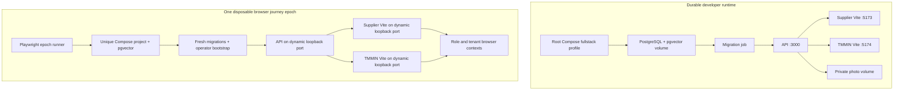

# Local Full-Stack and Browser E2E Architecture

## Runtime Separation

The two runtimes do not share databases, ports, photo storage, credentials, or cleanup policy. The
developer runtime supports interactive work with durable local data. Every browser journey starts
from an isolated empty database and always destroys its data.

## Developer Startup Order

The root `fullstack` profile preserves PostgreSQL as an independently usable service for existing
`db:*` commands. Full-stack startup is ordered:

1. PostgreSQL reports healthy.
2. The one-shot migration service applies committed Prisma migrations.
3. The API starts and reports ready.
4. Supplier and TMMIN Vite services start only after API readiness.

Published ports bind to loopback. Canonical developer origins are:

- Supplier: `http://localhost:5173`
- TMMIN: `http://localhost:5174`
- API: `http://localhost:3000`
- PostgreSQL: `127.0.0.1:55432`

Using the same `localhost` host aligns CORS, CSRF origin checks, and strict cookie behavior. The
browser harness uses matching `127.0.0.1` origins on dynamic ports.

## Data and Bootstrap Ownership

PostgreSQL and normalized private member photos use separate named volumes. `local:down` removes
services and the network but preserves both volumes. `local:destroy` is explicit and destructive.

The protected TMMIN administrator remains operator-owned. Local Compose reads its bootstrap values
from an untracked `.env`, and `local:bootstrap` invokes the normal operator CLI. No credentials are
tracked or invented by Compose.

## Journey Isolation

The epoch runner selects unused loopback ports and a unique Compose project name. It starts only a
disposable pgvector database, verifies PostgreSQL and the extension, applies fresh migrations,
creates the protected identity through the operator CLI, then launches compiled API and Vite child
processes. Readiness probes gate the scenario.

Tests provision domain records through public API or browser behavior. Direct database access is
limited to database creation/reset, extension verification, migrations, and protected bootstrap.
There is no fixture endpoint or production fallback.

Scenarios execute serially within an epoch. Roles and tenants use distinct contexts so cookies,
CSRF state, and authorization cannot bleed between actors. One shared-context test intentionally
logs in to both realms to prove their cookies coexist.

## Browser and Artifact Strategy

Chromium runs the complete journey suite at 1280×720. Tagged critical authentication, lifecycle,
authorization, and accessibility coverage also runs against pinned Microsoft Edge. Failure
diagnostics retain:

- Playwright trace;
- screenshot and video;
- browser console errors;
- failed network requests;
- HTML and blob reports.

Reports are local build artifacts and are uploaded by the browser CI job only on failure.

## Cleanup Guarantees

The runner registers normal, exception, and signal cleanup. It terminates the API and Vite process
groups, runs Compose down with volumes and orphan removal for the exact epoch project, and removes
the epoch photo directory. Cleanup is idempotent so partial startup cannot strand resources.

An intentional failure is used to prove the command exits nonzero, artifacts remain available, and
no epoch process, container, network, or volume survives.
