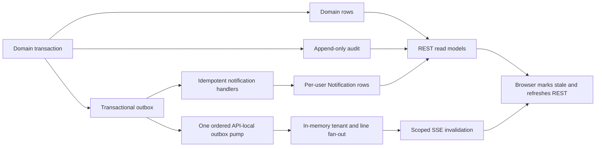

# Read Models, Notification, and Realtime Architecture

## Authority Boundary

PostgreSQL domain tables are authoritative. Notification persistence is a durable user-facing
derivative. Assignment Board, dashboard, warning, and audit responses are assembled by bounded
server-side queries. Browser state and SSE delivery are never authoritative.

## Write-to-read Flow

## Notification Rules

- `(sourceEventId, recipientUserId)` is the delivery idempotency boundary.
- Hosted events resolve active users in the event supplier. External projection events resolve
  active TMMIN Admin users.
- Approval notifications resolve the current persisted route responsibility.
- Terminal notifications include the creator and Supplier Admin.
- Vacancy and override notifications include the affected line ownership and Supplier Admin.
- External warning notifications deep-link to the read-only TMMIN projection.
- Read/unread changes only `Notification.readAt` and `Notification.version`.
- Deep links are relative resource paths and are still protected by destination authorization.

## Assignment Board

The board returns one payload containing active Shift Runs, ordered Working Assignments, hosted MP
identity/photo metadata, vacancy/reservation/conflict state, and Open/Approved 4M indicators.
Supervisor and Line Leader predicates are applied before records are loaded. Supplier Admin and QC
may view all tenant lines. TMMIN support reads remain separate from supplier browser APIs.

The payload includes:

- a deterministic version digest;
- the maximum included update timestamp;
- explicit category and lifecycle labels in addition to visual-color semantics;
- stable assignment and Henkaten identifiers.

## Dashboard and Audit

Aggregations execute in PostgreSQL and return bounded distributions. Lists use cursor pagination or
fixed top/recent limits. Audit serialization removes credential-, token-, photo-, authorization-, and
registration-related keys. Access to supplier audit lists is limited to Supplier Admin; TMMIN audit
access requires an explicit cross-tenant capability.

## SSE Contract

SSE transports invalidation metadata only:

- outbox event ID as the SSE ID;
- event and aggregate type;
- aggregate identity and version;
- occurrence timestamp;
- REST topics to refresh;
- an additive resync control event when a requested replay position is unavailable.

One API-local pump polls the globally ordered outbox at the validated `REALTIME_POLL_MS` interval,
which defaults to one second. Database polling is independent of connected browser count. The pump
fans events to live connections in memory; each connection filters by tenant and permitted lines.

`Last-Event-ID` resumes against retained outbox events before live subscription. Replay is bounded
to 500 events. If the cursor is unavailable or the replay window is exceeded, the stream emits
`resync`; the client marks its data stale and performs an authoritative REST refetch. Heartbeats are
sent every 15 seconds. A disconnected client likewise displays stale state and refreshes after
reconnect.

This fan-out design relies on the single-API-process topology. Multiple API replicas would require
connection affinity or shared event distribution before they could preserve the same live-delivery
guarantee.

## Propagation Validation

Disposable full-stack browser coverage creates a domain mutation through the real API, observes its
scoped SSE invalidation, and verifies that the Assignment Board refetches within five seconds. Unit
coverage separately verifies configuration bounds, replay ordering, authorization scope, resync,
deduplication, and browser stale-state behavior.

## Query Evolution

Indexes support notification unread lists, warning aggregation, active assignments, Henkaten
filters, and audit timelines. Projection tables or materialized views may only be added after query
plan and latency evidence demonstrates that bounded direct queries cannot meet the accepted targets.
