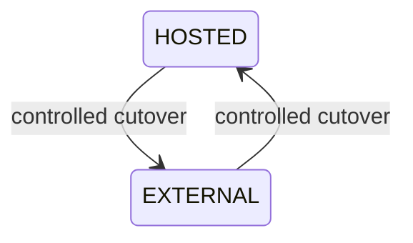
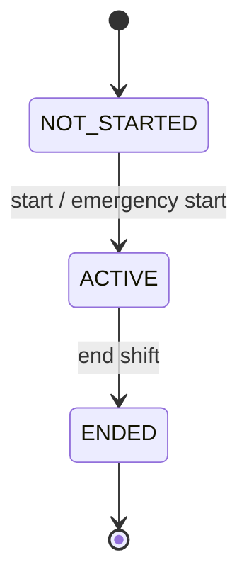
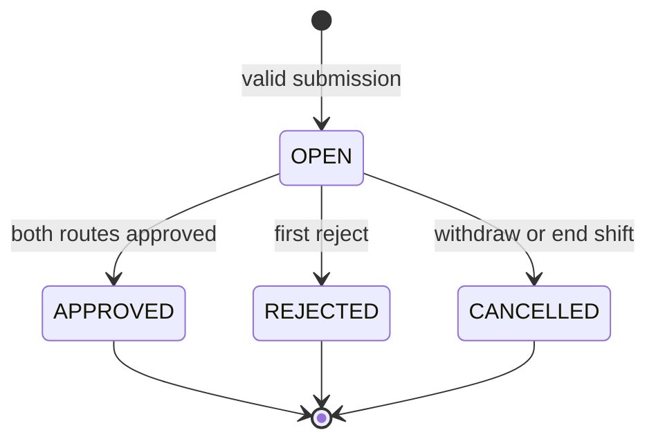
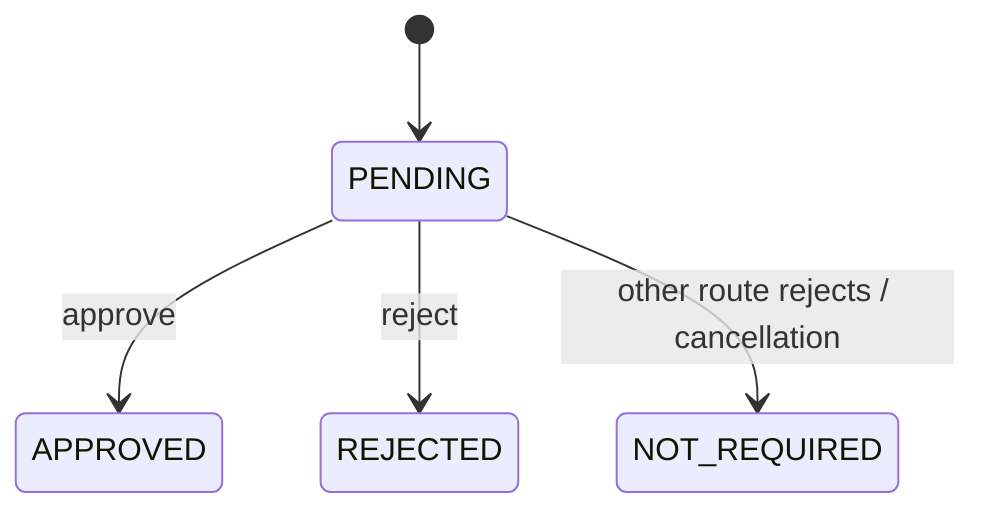
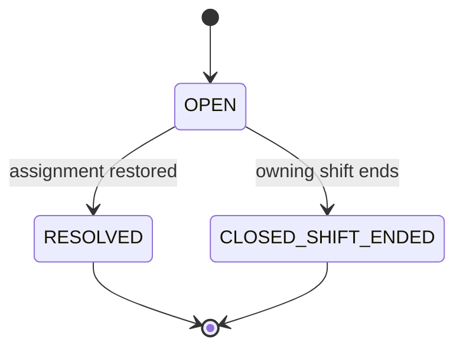

# Normative State Machines

Status: Normative implementation baseline

Date: 2026-07-23

The transition tables are normative. Diagrams are explanatory.

## 1. Supplier Source Mode

The persisted mode is `HOSTED` or `EXTERNAL`. Cutover is an atomic command rather than a third
persistent mode.

| Current | Command | Preconditions | Result |
|---|---|---|---|
| HOSTED | Cut over to External | no active shift/Open Henkaten; valid External credential | EXTERNAL, epoch + 1 |
| EXTERNAL | Cut over to Hosted | no Open projection; Hosted preflight valid | HOSTED, epoch + 1 |
| either | Set same mode | none | rejected as `STATE_CONFLICT` |

Historic data retains its original mode and epoch. The old source's sessions or credentials are
revoked in the cutover transaction.

Initial provisioning is not a cutover: `HOSTED` is created active with a Supplier Admin, while
`EXTERNAL` is created inactive without a platform Supplier Admin until Phase 9 credentials exist.

### 1.1 Hosted Preparation

`HostedPreparation` has `ACTIVE`, `COMPLETED`, and `CANCELLED` states. It is not a SourceMode.

| Current | Command | Result |
|---|---|---|
| none | start on EXTERNAL with privacy acknowledgement | ACTIVE; preparation admin created |
| ACTIVE | cancel | CANCELLED; admin inactive; sessions revoked |
| ACTIVE | successful EXTERNAL → HOSTED cutover | COMPLETED in the cutover transaction |
| COMPLETED/CANCELLED | any mutation | rejected |

While ACTIVE, External remains source of truth. Only preparation-scoped configuration writes may
be added by Phase 4; shift and Henkaten operational writes remain denied.

## 2. User and Session

User account state is `ACTIVE` or `INACTIVE`. `mustChangePassword`, `lockedUntil`, and failed-attempt
windows are separate attributes rather than durable role states.

| Current | Trigger | Result |
|---|---|---|
| ACTIVE | deactivate | INACTIVE and all sessions revoked |
| INACTIVE | reactivate | ACTIVE, no prior session restored |
| ACTIVE | reset/change password | ACTIVE, sessions revoked, password epoch increased |
| ACTIVE | role change | rejected; operational member role is immutable |

Session:

| Current | Trigger | Result |
|---|---|---|
| ACTIVE | logout/revoke/security change | REVOKED |
| ACTIVE | idle timeout | EXPIRED |
| ACTIVE | absolute timeout | EXPIRED |
| REVOKED/EXPIRED | any authenticated use | rejected |

Session state is derived from `revokedAt`, `idleExpiresAt`, and `absoluteExpiresAt`; terminal sessions
are not reactivated.

Session purpose is `NORMAL` or `HOSTED_PREPARATION`. A preparation session does not inherit Hosted
operational capabilities.

## 3. Shift Run

| From | Command | To | Actor | Required behavior |
|---|---|---|---|---|
| NOT_STARTED | Start Shift | ACTIVE | LL own line | all hard gates pass |
| NOT_STARTED | Emergency Start | ACTIVE | Supplier Admin | reason and failed gates audited |
| ACTIVE | End Shift | ENDED | LL own line | cancel Open, release, close, reset |

All other transitions return `INVALID_TRANSITION`. `ENDED` is terminal.

## 4. Henkaten

| From | Trigger | To | Warning | Man assignment |
|---|---|---|---|---|
| new | submit | OPEN | opened | reservation only |
| OPEN | both routes approved | APPROVED | closed | movement applied |
| OPEN | first reject | REJECTED | closed | unchanged, reservation released |
| OPEN | LL withdraw | CANCELLED | closed | unchanged, reservation released |
| OPEN | End Shift | CANCELLED | closed | unchanged, reservation released |

Terminal records are immutable. `isClosed` is derived as status not equal to `OPEN`.

## 5. Approval Route

| From | Decision/event | To |
|---|---|---|
| PENDING | valid Approve | APPROVED |
| PENDING | valid Reject | REJECTED |
| PENDING | other route rejects | NOT_REQUIRED |
| PENDING | Henkaten cancelled | NOT_REQUIRED |

Route states are terminal after leaving `PENDING`. One stored decision is permitted per route.

## 6. MP Reservation

Reservation state is represented as:

- `ACTIVE`: created and `releasedAt` absent;
- `RELEASED`: `releasedAt` and release reason present.

| Current | Trigger | Result |
|---|---|---|
| none | valid Man Open | ACTIVE |
| ACTIVE | final Approved | RELEASED after movement |
| ACTIVE | reject | RELEASED without movement |
| ACTIVE | withdraw | RELEASED without movement |
| ACTIVE | End Shift | RELEASED without movement |

An MP and target job may each have only one conflicting active reservation. A released reservation
cannot be reactivated.

## 7. Assignment Issue

`RESOLVED` and `CLOSED_SHIFT_ENDED` are terminal. Closing at shift end preserves the issue history
and does not silently fill the vacant job.

## 8. Warning

| Current | Event | Result |
|---|---|---|
| none | Hosted/External Henkaten becomes Open | OPEN |
| OPEN | Approved | CLOSED |
| OPEN | Rejected | CLOSED |
| OPEN | Cancelled | CLOSED |

A warning cannot be closed manually. Aggregate part state is derived: a supplier/part is
`AFFECTED` while at least one warning is Open.

## 9. External Projection

| Current | Event | Preconditions | Result |
|---|---|---|---|
| none | HENKATEN_OPENED | sourceVersion 1 | OPEN |
| OPEN | HENKATEN_OPEN_UPDATED | next contiguous version | OPEN |
| OPEN | HENKATEN_APPROVED | next version; both approval decisions | APPROVED |
| OPEN | HENKATEN_REJECTED | next version; at least one reject | REJECTED |
| OPEN | HENKATEN_CANCELLED | next version; cancellation reason | CANCELLED |
| terminal | any event | none | rejected |

Identical `eventId` and canonical payload hash is a successful duplicate. The same event ID with a
different hash is `IDEMPOTENCY_CONFLICT`. A missing or stale source version is
`SOURCE_VERSION_OUT_OF_ORDER`.

## 10. Ingestion Result

Per item:

- `ACCEPTED`: new raw event and projection result committed;
- `DUPLICATE`: identical event already committed;
- `REJECTED`: validation or transition failed and error details are returned/stored safely.

Batch envelope validation failure rejects the envelope. A valid batch processes items independently.

## 11. Forbidden Transition Rules

- No terminal Henkaten or approval route can be reopened.
- No Ended ShiftRun can be restarted.
- No released reservation can become active.
- No terminal external projection can accept a later event.
- No source mode can change while active work exists.
- No stale expected version can be silently overwritten.
